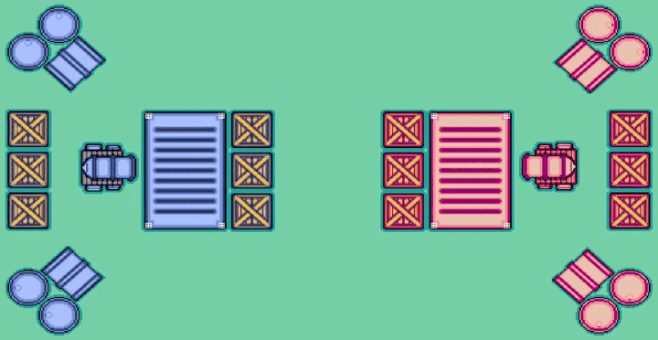

# Mini-Cannon-Carts
 
### Sobre o projeto

🚧⚠️ **Em desenvolvimento...** ⚠️🚧

**Mini-Cannon-Carts** é um jogo multiplayer local onde dois jogadores controlam carroças equipadas com canhões em uma arena compacta. Com pixel art deslumbrante e uma perspectiva top-down, o jogo oferece uma experiência emocionante com ação intensa, um ambiente interativo onde é possível destruir caixas, barris e contêineres, efeitos realistas onde tiros fazem os objetos tremer e se mover, além de dano próprio, onde tiros podem causar dano a você mesmo, mas reduzido.

Manobre, atire e conquiste a vitória em **Mini-Cannon-Carts**! Está pronto para o desafio? 

